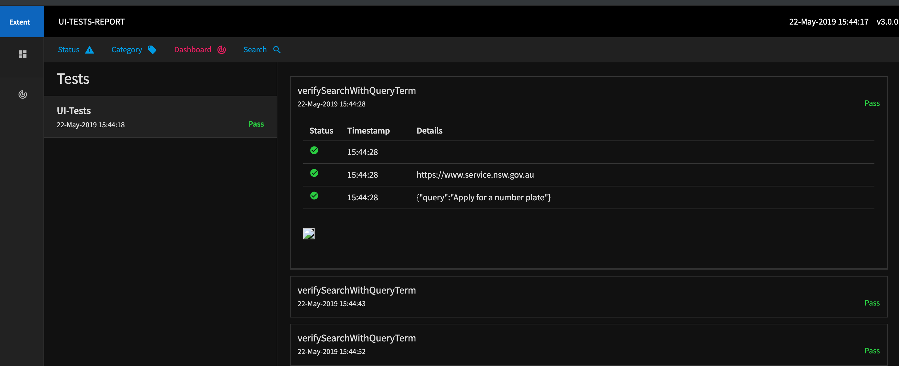

# UI-TEST-DEMO

Project aims to demonstrate a simple way of automating the Web-UI using open-source tools like Selenium, testNg as testing tools with Maven as a build tool along with great support of data-driven testing and html report generation.


## Installation
 ```
* git clone project : git@github.com:mayank-kapoor/ui-test-demo.git

* cd ui-test-demo

* mvn clean compile

#RUN TESTS
mvn clean test -Dbrowser=Chrome/FF

#where -Dbrowser is a command line argument to choose the browser to run the tests, 
defaults to Chrome only.

#It automatically detects the OS version and picks up browser provided in param above.


```
## Reports
```
Html Reports at the end of execution is available in /target folder 
with test name, test status, test data and screenshots for failures

Sample Report Screenshot

<p align="center">
  
</p>

```

##CI/CD
```
Can be directely integrated with CI/CD tools like Jenkins, travis for deployement and 
send notifications on Slack, PagerDuty.

```


 

## Contributing

```Pull requests and feedbacks are welcome.Please make sure to update tests as appropriate.
```
